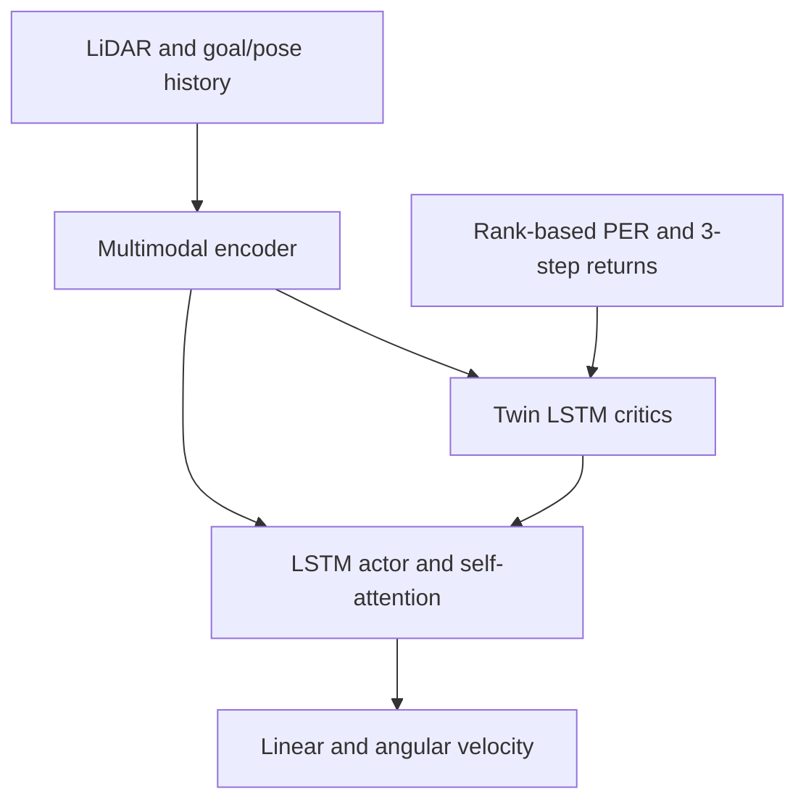

# SAL-TD3 for Dynamic Mobile-Robot Navigation

[](https://doi.org/10.1038/s41598-026-45819-0)
[](https://github.com/DrChenYou/Paper-2-SAL-TD3-Robot-Navigation/actions/workflows/ci.yml)


Research companion repository for:

> Luyun Chen, Qiang Tang, Rui Xu, and You Chen. **Integrating self-attention and LSTM into TD3 for robust mobile robot navigation in dynamic environments.** *Scientific Reports* 16, 16159 (2026). https://doi.org/10.1038/s41598-026-45819-0

You Chen is the corresponding author of the associated article.

SAL-TD3 combines Twin Delayed Deep Deterministic Policy Gradient with recurrent temporal modelling, four-head self-attention, rank-based prioritized replay, three-step returns, and a navigation-specific reward. The code separates the learning algorithm from ROS/Gazebo so that the neural networks, replay logic, and reward can be tested without a robot installation.

## Method

The paper processes a 360-sample LiDAR scan with two one-dimensional convolutional layers (32 and 64 filters) and processes goal/pose information through a fully connected branch. Their fused state history is passed to an LSTM actor with four-head self-attention. Two independent LSTM critics implement clipped double-Q learning.



### Paper configuration

| Parameter | Value |
| --- | ---: |
| Actor learning rate | 0.0003 |
| Critic learning rate | 0.0008 |
| Discount factor | 0.98 |
| Target update coefficient | 0.005 |
| Batch size | 256 |
| Replay capacity | 100,000 |
| Policy update delay | 3 |
| Target policy noise / clip | 0.2 / 0.5 |
| PER alpha / initial beta | 0.6 / 0.4 |
| Multi-step horizon | 3 |
| LSTM hidden size | 128 |
| Attention heads | 4 |
| Training episodes / maximum steps | 1,500 / 500 |

### Published results

The principal wide-area experiment used 100 trials per method.

| Method | Path length (m) | Time (s) | Success | Collision |
| --- | ---: | ---: | ---: | ---: |
| SAL-TD3 | 5.18 | 62 | 91% | 9% |
| L-TD3 | 5.47 | 69 | 86% | 14% |
| P-TD3 | 5.56 | 74 | 83% | 17% |
| TD3 | 6.21 | 89 | 77% | 23% |
| DDPG | 6.58 | 97 | 71% | 29% |
| SAC | 5.89 | 78 | 79% | 21% |

In the narrow-area experiment, SAL-TD3 achieved 88% success and 12% collision. The paper also reports an 84.5% mean success rate in unseen configurations and successful deployment on an AgileX BUNKER platform.

## Repository structure

```text
.
|-- configs/sal_td3.yaml       # Paper hyperparameters and environment fields
|-- scripts/smoke_train.py     # CPU/GPU algorithm sanity run
|-- src/sal_td3/
|   |-- agent.py               # TD3 updates and target networks
|   |-- networks.py            # LiDAR encoder, actor, and twin critics
|   |-- replay.py              # Rank-based PER with n-step returns
|   `-- reward.py              # Composite navigation reward
|-- tests/                     # Unit and integration tests
|-- ENVIRONMENT.md             # ROS/Gazebo adapter contract
`-- MODEL_CARD.md              # Intended use and limitations
```

## Quick start

Using Conda:

```bash
conda env create -f environment.yml
conda activate sal-td3
```

Or using a Python virtual environment:

```bash
python -m venv .venv
source .venv/bin/activate
pip install -e ".[dev]"
pytest -q
python scripts/smoke_train.py --steps 10
```

The smoke run uses synthetic state histories and verifies the complete optimization path. It is not a navigation benchmark.

## ROS/Gazebo integration

The paper used Ubuntu 20.04, ROS, Gazebo, TurtleBot3 Waffle Pi, and a 360-degree LiDAR. Implement an adapter that produces fixed-length state histories and accepts normalized two-dimensional actions, then connect it to `SALTD3Agent` and `RankBasedNStepReplay`. The exact observation and terminal contracts are documented in [ENVIRONMENT.md](ENVIRONMENT.md).

The reward helper follows the equations in the paper:

- heading alignment: `4 * (1 - abs(alpha))`;
- progress: `2 * clip(previous_distance / current_distance, 0.5, 4.0)`;
- obstacle penalty: `-5` below 0.5 m;
- terminal reward: `+1000` at the goal and `-800` on collision.

The goal threshold is 0.3 m.

## Reproducible reporting

Use at least 100 evaluation trials per scenario, report path length, execution time, success rate, and collision rate, and keep training and evaluation maps separate. Record the ROS/Gazebo versions, random seeds, robot geometry, LiDAR preprocessing, action limits, and obstacle trajectories with every run.

## Data and environments

The article states that the analysed datasets are available from the corresponding author on reasonable request. The Gazebo worlds, recorded scans, and robot logs are therefore expected under local ignored directories and are not embedded in this repository. See [ENVIRONMENT.md](ENVIRONMENT.md).

## Citation

```bibtex
@article{chen2026saltd3,
  author  = {Chen, Luyun and Tang, Qiang and Xu, Rui and Chen, You},
  title   = {Integrating self-attention and LSTM into TD3 for robust mobile robot navigation in dynamic environments},
  journal = {Scientific Reports},
  volume  = {16},
  pages   = {16159},
  year    = {2026},
  doi     = {10.1038/s41598-026-45819-0}
}
```

## License

Repository code is released under the [MIT License](LICENSE). The article and third-party robot/simulator assets retain their own licences.
